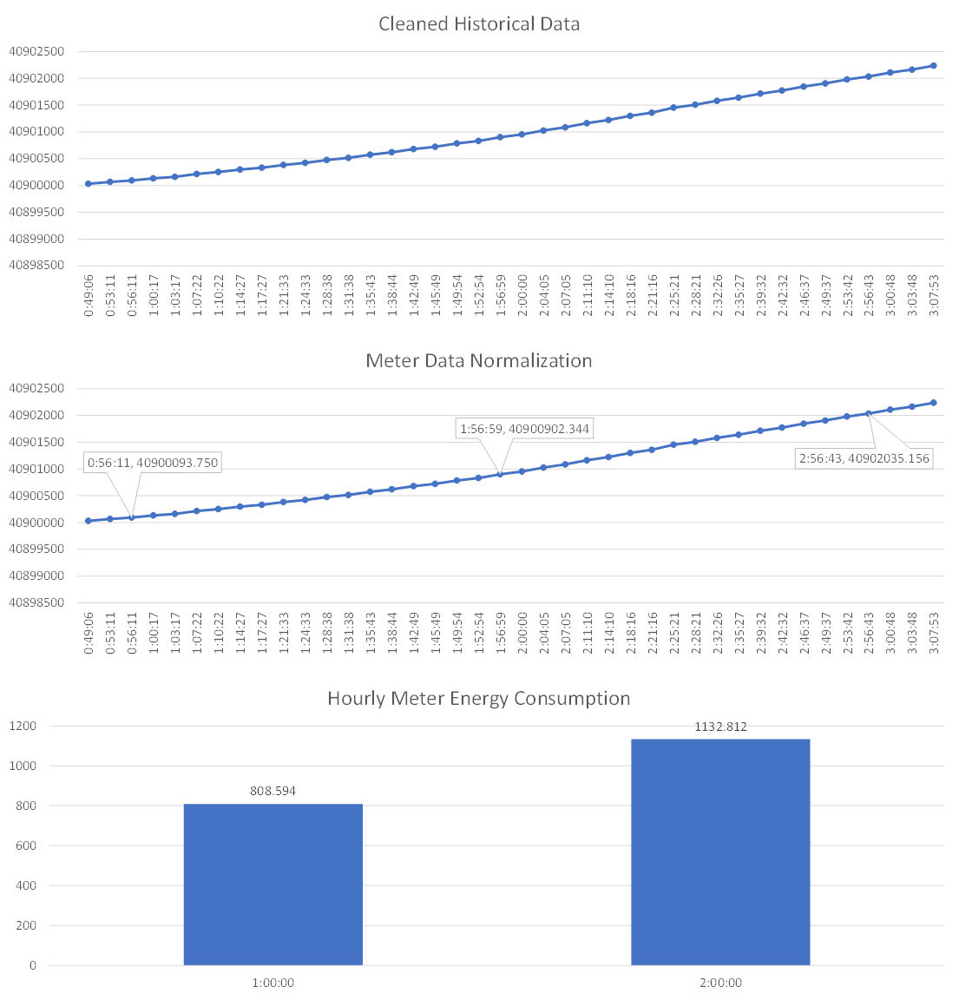

# myems-normalization

MyEMS Normalization Service 

数据规范化服务

## Introduction

This service is a component of MyEMS to normalize energy data in historical database.



## Dependencies

mysql-connector-python

openpyxl

sympy

python-decouple


## Quick Run for Development

```bash
cd myems/myems-normalization
pip install -r requirements.txt
cp example.env .env
chmod +x run.sh
./run.sh
```

## Installation

### Option 1: Install myems-normalization on Docker

Refer to [myems.io](https://myems.io/docs/installation/docker-linux#step-6-myems-normalization)

### Installation Option 2: Online install on Ubuntu server with internet access

Refer to [myems.io](https://myems.io/docs/installation/debian-ubuntu#step-6-myems-normalization)

### Installation Option 3: Offline install on Ubuntu server without internet access

In this section, you will install myems-normalization on Ubuntu Server.

Download and install MySQL Connector:
```bash
cd ~/tools
wget https://cdn.mysql.com//Downloads/Connector-Python/mysql-connector-python-8.0.28.tar.gz
tar xzf mysql-connector-python-8.0.28.tar.gz
cd ~/tools/mysql-connector-python-8.0.28
python3 setup.py install
```

Download and install mpmath
```bash
cd ~/tools
git clone https://github.com/fredrik-johansson/mpmath.git
cd ~/tools/mpmath
python3 setup.py install
```

Download and install SymPy
```bash
cd ~/tools
git clone https://github.com/sympy/sympy.git
cd ~/tools/sympy
python3 setupegg.py develop
```

Download and install openpyxl
```bash
cd ~/tools
```
Get the latest version of et_xmlfile from https://foss.heptapod.net/openpyxl/et_xmlfile/
```bash
wget https://foss.heptapod.net/openpyxl/et_xmlfile/-/archive/1.1/et_xmlfile-1.1.tar.gz
tar xzf et_xmlfile-1.1.tar.gz
```
Get jdcal
```bash
git clone https://github.com/phn/jdcal.git
```
Get the latest version of openpyxl from https://foss.heptapod.net/openpyxl/openpyxl
```bash
wget https://foss.heptapod.net/openpyxl/openpyxl/-/archive/3.0.7/openpyxl-3.0.7.tar.gz
tar xzf openpyxl-3.0.7.tar.gz
```

```bash
cd ~/tools/et_xmlfile-1.1
python3 setup.py install
cd ~/tools/jdcal
python3 setup.py install
cd ~/tools/openpyxl-3.0.7
python3 setup.py install
```

Download and install Python Decouple
```bash
cd ~/tools
git clone https://github.com/henriquebastos/python-decouple.git
cd ~/tools/python-decouple
python3 setup.py  install
```

Install myems-normalization service:
```bash
cp -r myems/myems-normalization /myems-normalization
cd /myems-normalization
```
Copy example.env file to .env file and modify the .env file:
```bash
cp /myems-normalization/example.env /myems-normalization/.env
nano /myems-normalization/.env
```
Setup systemd service:
```bash
cp myems-normalization.service /lib/systemd/system/
```
Enable the service:
```bash
systemctl enable myems-normalization.service
```
Start the service:
```bash
systemctl start myems-normalization.service
```
Monitor the service:
```bash
systemctl status myems-normalization.service
```
View the log:
```bash
cat /myems-normalization.log
```

### References

[1]. https://myems.io

[2]. https://dev.mysql.com/doc/connector-python/en/

[3]. https://github.com/sympy/sympy

[4]. https://openpyxl.readthedocs.io
